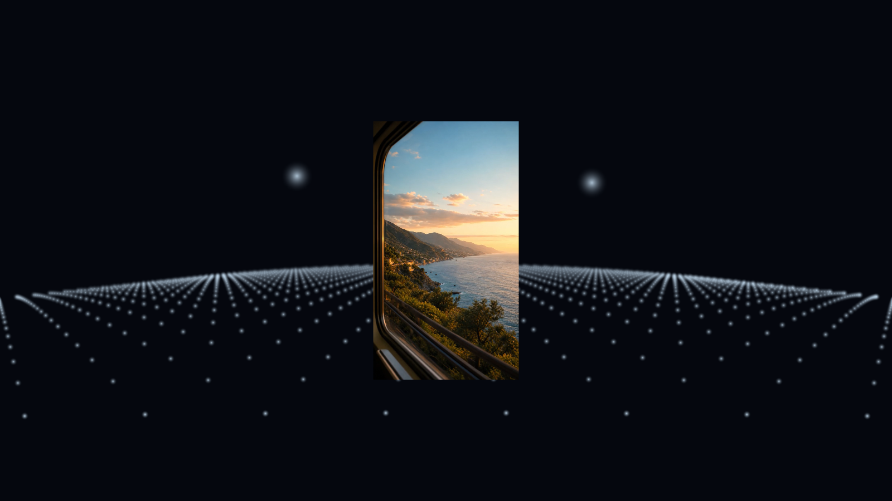

# InertialLink XR


**Research Preview — 医療機器ではなく、乗り物酔いを防ぐことが実証された製品でもありません。**

InertialLink XRは、車体に固定したAndroidスマートフォンの動きを、明示的に選択したVR空間のルートへ伝えるための、オープンな通信仕様、Android送信アプリ、Unity/OpenXRパッケージです。ゴーグルによる通常の頭部トラッキングと車体運動を分離し、研究者やXR開発者が監査・組み込みしやすい小さなAPIを提供します。

[Build Weekショーケース](docs/showcase.ja.md)・[English](README.md)・
[通信仕様](protocol/SPEC.md)・
[導入ガイド](docs/integration.ja.md)・[安全上の注意](docs/safety.ja.md)・
[セキュリティ](SECURITY.md)

> **同乗者専用です。** 運転中、自転車走行中、歩行中、機械操作中には使用・設定しないでください。不快感があれば直ちに使用を中止してください。本プロジェクトは、特定の人について酔いを予防・治療・軽減できるとは主張しません。

## OpenAI Build Weekで実現したこと

コンテスト期間中に、構想だけでなくAndroidからUnityまでの実動経路を完成させました。静止環境でXiaomi 13TとUnityを接続した試験では、認証済みモーションパケット216件を受理し、拒否・欠落は0件でした。中央の縦動画を固定したまま、その周囲に2,019個の方向キューを描画し、Cameraの姿勢が変わっていないことも確認しています。



別のPlay Mode試験では、現実側で測った加速度とVR内の加速度のズレを数値化し、安全な上限内の補正候補を表示できました。この外部モーション基準は、乗り物内の視覚キュー研究だけでなく、デジタルツインの位置合わせ、シミュレーター較正、モーションプラットフォームの品質確認にも展開できます。後者は将来の活用候補であり、製品としての検証が済んだという意味ではありません。

- [図と検証値を含む詳しいプロジェクト紹介](docs/showcase.ja.md)
- [デモ動画を見る](https://www.youtube.com/watch?v=cqnwPqBBy8E)
- [Devpost応募ページ](https://devpost.com/software/inertial-link-xr)
- [v0.2.0 Research Preview](https://github.com/YamaTro/inertial-link-xr/releases/tag/v0.2.0)

## 提供するもの

- 加速度、ジャイロ、重力、線形加速度、回転ベクトルを使うAndroid送信アプリ。カメラ、GPS、マイク、アカウント、クラウド、広告、テレメトリーは使用しません。
- 一時的な128ビットのペアリング鍵、HMAC-SHA-256の先頭128ビット、リプレイ拒否、時刻同期、値域検査、古いデータの拒否を備えた、バージョン管理済みのビッグエンディアンUDP仕様。
- 検証済みモーションサンプルを公開し、開発者が指定したコンテンツルートだけを動かすUnity 2022.3 LTS以降向けパッケージ。CameraやXR Originを含む階層の操作を拒否します。
- 決定論的な合成信号の送信、パケット検査、仕様テスト、記録検証を行う依存パッケージ不要のNode.jsツール。
- 実際の乗客情報や位置情報を収集せずに再現テストできる合成記録とドキュメント。
- 9:16の動画を固定しながら、曲面状に奥行き方向へ収束する背景で車両運動の向きを伝える方向スターグリッドのサンプル。
- 現実側で測った加速度とアプリ内の仮想加速度の差を表示し、上限付きの補正候補を報告する診断モニター。

Quest全体に表示するシステムオーバーレイ、OpenXRの頭部トラッキングの代替、位置推定、車両軌跡の復元、既存の任意アプリを外側から動かす機能は提供しません。利用するアプリが明示的に導入し、どのコンテンツに適用するかを決めます。

## 研究上の根拠

実車・車上環境を使った査読済み研究では、車両運動と同期する周辺視野または背景の視覚キューにより、酔いの指標が低下した結果が報告されています。加速度だけを使う疎なキューは、動画視聴のような主作業を妨げにくい可能性も報告されています。InertialLink XRは、この研究方向をUnity/OpenXRへ組み込みやすくする実装です。本プロジェクト自体が人を対象に同じ有効性を再現したとは主張しません。

2022年HFES、2024年IEEE Access、2017年CHI、2026年Applied Ergonomicsの論文と、主張できる範囲は[研究根拠と主張の境界（英語）](docs/research-basis.md)に整理しています。

## 構成

```text
車体に固定したAndroidスマホ              XRアプリ
┌──────────────────────┐   ローカルUDP   ┌────────────────────────┐
│ センサー → 取付変換   ├───────────────►│ 認証・再送・時刻・値域検査 │
│ セッションごとの一時鍵 │    ILXR v1.0   │ VehicleMotionHub       │
└──────────────────────┘◄───────────────┤ 時刻同期                 │
                                         │ 指定contentRootのみ操作  │
ゴーグルの頭部追跡 ─────────────────────►│ OpenXR Camera/XR Origin │
                                         └────────────────────────┘
```

通信上の座標系はOpenXRに合わせた右手系（+X：右、+Y：上、-Z：前）で、値はSI単位です。詳細は[通信仕様](protocol/SPEC.md)を参照してください。

## まず合成データで安全に試す

Node.js 24以降とUnity 2022.3 LTS以降が必要です。Android開発にはJDK 17とAndroid SDKも必要です。

次の鍵はループバック試験専用です。実機やネットワークでは再利用しないでください。

```text
00112233445566778899AABBCCDDEEFF
```

1つ目のターミナルで検査ツールを起動します。

```sh
node tools/packet-inspector.mjs --key 00112233445566778899AABBCCDDEEFF
```

2つ目のターミナルから、制限された合成旋回データを送ります。

```sh
node tools/synthetic-sender.mjs --key 00112233445566778899AABBCCDDEEFF --scenario gentle-turn --seconds 10
```

リポジトリの検査は次で実行します。

```sh
npm run check
```

両ツールとも既定ではループバックだけを使用し、`--allow-network`を明示しない限り外部インターフェースを拒否します。非ループバックでは1セッション鍵を`ILXR_PAIRING_KEY`で渡す必要があり、`--key`は公開テスト鍵によるループバック試験専用です。端末のセンサーを読み取ることもありません。

続いて[Unityへの導入](docs/integration.ja.md)、[Androidの準備](docs/android-setup.ja.md)、[較正チェックリスト](docs/calibration.ja.md)の順で進めてください。最初の試験を公道や公共交通機関で行わないでください。

## 重要な設計境界

**動きの忠実度より安全な失敗を優先します。** 不正、未認証、再送、未来時刻、期限切れのパケットでは安全タイマーを更新しません。有効な入力が止まると出力は中立位置へ徐々に戻り、最後の動きを保持し続けません。

**既定でプライベートです。** データはローカル通信内に留まり、探索ブロードキャスト、遠隔サービス、分析、GPS、ユーザーアカウントはありません。HMACは改ざんと送信元を検査しますが、暗号化ではありません。機密性が必要な場合は専用リンクか信頼できるトンネルを使用してください。

**統合用であり、端末全体を操作しません。** Unityドライバーは指定されたコンテンツTransformだけを変更します。Camera、XR Origin、無関係なUIより上位に配置してはいけません。詳しくは[制限事項](docs/limitations.ja.md)を参照してください。

## 現在の段階

v0.2の目的は、相互運用性と安全な異常時動作を検証することです。有効性を示す段階ではありません。APIや通信仕様のマイナーバージョンは変更される可能性があります。検証済み範囲と未検証事項は[検証記録（英語）](docs/VALIDATION.md)、予定は[ロードマップ](ROADMAP.md)で公開します。

脆弱性の報告は[SECURITY.md](SECURITY.md)、一般的な変更は[CONTRIBUTING.md](CONTRIBUTING.md)と[行動規範](CODE_OF_CONDUCT.md)をご覧ください。

## ライセンス

Apache License 2.0です。[LICENSE](LICENSE)、[NOTICE](NOTICE)、[第三者ソフトウェアの表示](THIRD_PARTY_NOTICES.md)を参照してください。
