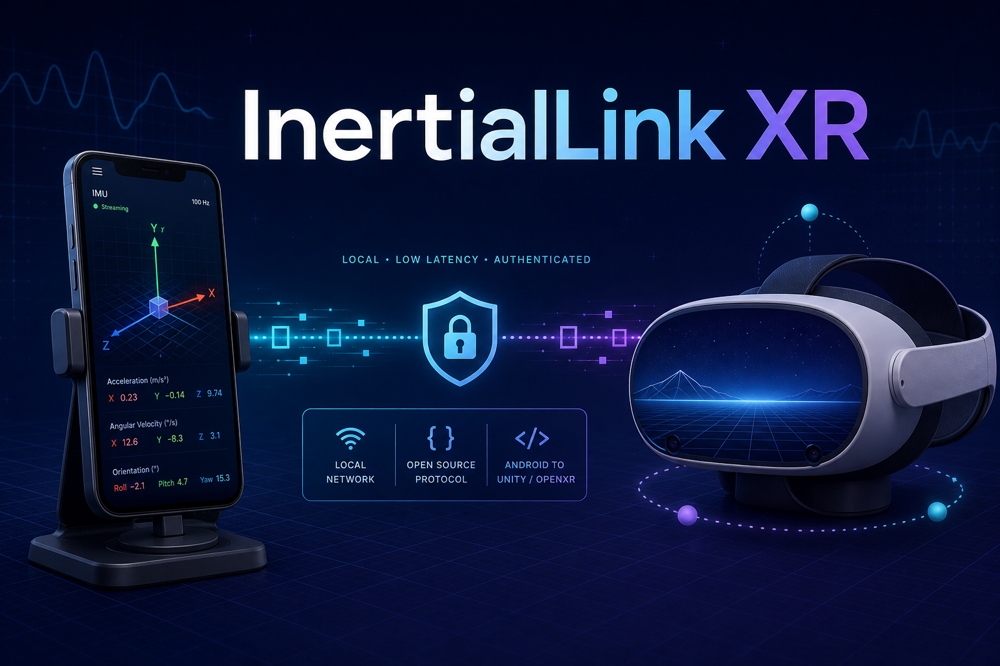

# InertialLink XR



**Research Preview — not a medical device and not proven to prevent motion sickness.**

InertialLink XR is an open protocol, Android motion sender, and Unity/OpenXR
package for driving an explicitly selected virtual environment root from a
vehicle-mounted phone. It keeps the headset's normal head tracking separate
from vehicle motion and gives researchers and XR developers a small,
auditable integration surface.


*Stationary Xiaomi XIG04 to Unity 6000.1.14f1 validation: 216 authenticated
packets accepted, 0 rejected, 2,019 directional cues, and Camera pose
unchanged. This verifies the integration path, not human comfort or efficacy.*

[日本語](README.ja.md) · [Protocol](protocol/SPEC.md) ·
[Integration guide](docs/integration.md) · [Safety](docs/safety.md) ·
[Security](SECURITY.md)

> **Passenger use only.** Never use or configure a headset while driving,
> cycling, walking, or controlling machinery. Stop immediately if you feel
> discomfort. The project makes no claim that its cues prevent, treat, or
> reduce sickness for any particular person.

## What this project provides

- An Android sender using acceleration, gyroscope, gravity, linear
  acceleration, and rotation-vector sensors—without camera, GPS, microphone,
  account, cloud, advertising, or telemetry permissions.
- A versioned, big-endian UDP protocol with an ephemeral 128-bit pairing key,
  truncated HMAC-SHA-256 authentication, replay rejection, clock sync, strict
  bounds, and stale-data rejection.
- A Unity 2022.3 LTS+ package that exposes validated motion samples and can
  drive only a deliberately assigned content root. It refuses to drive a
  Camera or XR Origin hierarchy.
- Dependency-free Node.js tools for deterministic synthetic signals, packet
  inspection, protocol tests, and recording validation.
- Synthetic recordings and documentation for repeatable development without
  collecting real passenger or location data.
- A directional star-grid sample that keeps a 9:16 video fixed while a curved,
  perspective-converging background conveys vehicle motion, plus a diagnostic monitor for
  measured-versus-virtual acceleration mismatch and bounded correction suggestions.

It does **not** provide a Quest-wide/system overlay, replace OpenXR head
tracking, infer location, reconstruct a vehicle trajectory, or make arbitrary
third-party applications move. Applications opt in and choose exactly which
content consumes motion data.

## Research basis

Peer-reviewed on-road/on-vehicle studies have reported lower sickness with
vehicle-synchronized peripheral or background visual cues. Recent work also
reports that sparse acceleration-based cues can reduce distraction during tasks
such as watching a movie. InertialLink XR turns that research direction into a
reusable Unity/OpenXR integration layer; it does **not** claim that this
implementation has independently reproduced the human-subject results.

See [Research basis and claim boundary](docs/research-basis.md) for the cited
2022 HFES, 2024 IEEE Access, 2017 CHI, and 2026 Applied Ergonomics studies.

## Architecture

```text
vehicle-fixed Android phone                 XR application
┌──────────────────────────┐    local UDP   ┌────────────────────────────┐
│ sensors → mount transform├───────────────►│ authenticated receiver     │
│ ephemeral pairing key    │   ILXR v1.0    │ replay/age/range checks    │
└──────────────────────────┘◄───────────────┤ clock synchronisation      │
                                            │ VehicleMotionHub           │
headset tracking ──────────────────────────►│ OpenXR Camera/XR Origin    │
                                            │ selected contentRoot only  │
                                            └────────────────────────────┘
```

The wire coordinate system is OpenXR-style right-handed: +X right, +Y up,
and -Z forward. All transport values use SI units. See the normative
[protocol specification](protocol/SPEC.md).

## Start safely with synthetic data

Requirements: Node.js 24+ and Unity 2022.3 LTS or newer. Android development
additionally requires JDK 17 and the Android SDK.

1. Generate a temporary 16-byte key. Do not reuse this documentation value
   outside loopback testing:

   ```text
   00112233445566778899AABBCCDDEEFF
   ```

2. In one terminal, run the loopback-only inspector:

   ```sh
   node tools/packet-inspector.mjs --key 00112233445566778899AABBCCDDEEFF
   ```

3. In another terminal, send a bounded synthetic turn:

   ```sh
   node tools/synthetic-sender.mjs --key 00112233445566778899AABBCCDDEEFF --scenario gentle-turn --seconds 10
   ```

4. Run the repository checks:

   ```sh
   npm run check
   ```

Both tools bind to loopback by default and refuse non-loopback networking
unless `--allow-network` is explicitly supplied. Non-loopback Node use also
requires the one-session key in `ILXR_PAIRING_KEY`; `--key` is reserved for
public-vector loopback tests. They never read device sensors.

Next, follow [Unity integration](docs/integration.md), then
[Android setup](docs/android-setup.md), and complete the
[calibration checklist](docs/calibration.md) before any stationary-vehicle
test. Do not begin with a public-road or public-transport trial.

## Repository layout

| Path | Purpose |
| --- | --- |
| `android/` | Kotlin protocol library, Android motion source, and sender app |
| `unity/` | Unity Package Manager package and tests |
| `protocol/` | Normative wire-format specification |
| `tools/` | Dependency-free synthetic sender, inspector, and validators |
| `recordings/` | Synthetic-only example recordings |
| `docs/` | Architecture, integration, calibration, safety, and threat model |

The exact automated and manual verification coverage—and the gaps that remain—is
recorded in [Validation](docs/VALIDATION.md).

## Design boundaries

**Safety before motion fidelity.** Invalid, unauthenticated, replayed, future,
or stale packets cannot refresh the receiver's safety timer. When valid input
stops, output fades to neutral; it never holds the last motion indefinitely.

**Private by default.** Motion stays on the local link. There is no discovery
broadcast, remote service, analytics, GPS, or user account. HMAC authenticates
packets but does not encrypt them; use a private link or a trusted tunnel if
motion-data confidentiality matters.

**Integration, not global control.** The Unity driver modifies only the
assigned content transform. It must not be placed above a Camera, XR Origin,
or unrelated application UI. See [limitations](docs/limitations.md).

## Built with Codex and GPT-5.6

InertialLink XR was created during OpenAI Build Week in a Codex session using
GPT-5.6. The builder set the product constraints and safety boundaries; Codex
helped turn them into a cross-language implementation, tests, documentation,
and release automation.

Codex accelerated the work by:

- decomposing the idea into a versioned wire protocol, Android sender, Unity
  package, and dependency-free synthetic tools;
- implementing shared authenticated packet vectors across Kotlin, C#, and
  Node.js, then adding failure-path tests for tampering, replay, stale data,
  invalid numbers, and safe fade-out;
- reviewing the permission and data-flow surface so the Android app could ship
  without camera, microphone, location, account, advertising, or telemetry
  permissions; and
- producing reproducible validation notes and release artifacts while clearly
  separating verified checks from unavailable hardware and human testing.

The key product decisions remained explicit human choices: use a
vehicle-mounted phone as an external vehicle-motion reference; preserve normal
head tracking; modify only an opt-in content root; fail closed on invalid or
missing data; and make no motion-sickness efficacy claim. See the detailed
[Build Week collaboration record](docs/OPENAI_BUILD_WEEK.md).

## Project status

The v0.2 goal is interoperability and safe failure behavior, not an efficacy
claim. APIs and wire-protocol minor versions may evolve. Compatibility rules
are documented in the [specification](protocol/SPEC.md), and planned work is
tracked in the [roadmap](ROADMAP.md).

Security reports should follow [SECURITY.md](SECURITY.md). General changes are
welcome under [CONTRIBUTING.md](CONTRIBUTING.md) and the
[Code of Conduct](CODE_OF_CONDUCT.md).

## License

Apache License 2.0. See [LICENSE](LICENSE), [NOTICE](NOTICE), and
[third-party notices](THIRD_PARTY_NOTICES.md).
